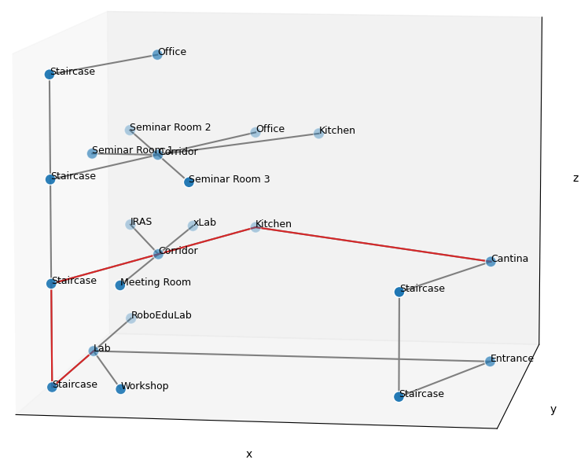
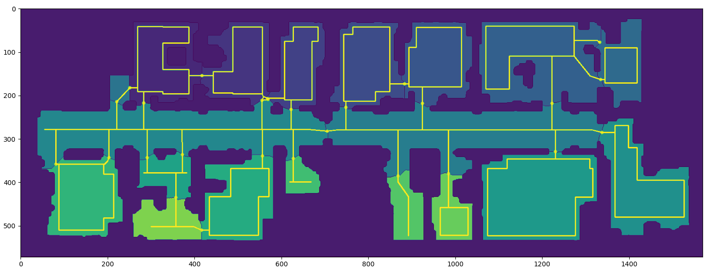

# Semantic Hierarchical Graph for Navigation

Creates a hierarchical data structure where each node in a graph is a new graph.



The main achievements of this work are:

1. Navigate in muti-story environments in shared human-robot spaces
2. The environment can be arbitrary complex with multiple hierarchy levels:
    - Campus
    - Building
    - Floor
    - Room
    - Roadmaps / Locations
3. Plan in the hierarchy graph COMPLETE and OPTIMAL with Djikstra.
4. Plan on gridmap level COMPLETE but NOT optimal with ILIR (Iterative largest interior rectangles), instead choose paths which avoid public crowded spaces by design.
    - Introduce new metric for disturbance of public space
5. Integrate planner in ROS2 Foxy Navigation stack as plugin
6. (TODO) Include semantic information about the environment in path planning.
    - Define no-go zones or reduced speed zones
    - Add important locations (pick-up points, elevator, info, toilet, ...)
7. (TODO) Provide GUI for easily adding and editing semantic information


## Datastructure of the Semantic Hierarchical Graph (SHG)

The graph for navigation is build with one single node class.  
Each node holds a graph with all its sublevel children.  
This makes it possible to plan recursive through all hierarchies:

```python
path_dict = G.plan_recursive(["Building F", "Floor 0", "Lab"], ["Building A", "Floor 1", "Cantina"])
```

<details>
  <summary>solution_path.json</summary>

```json
{
    "Building F": {
        "Floor 0": {
            "Lab": {},
            "Staircase": {},
            "Floor 1_Staircase_bridge": {}
        },
        "Floor 1": {
            "Floor 0_Staircase_bridge": {},
            "Staircase": {},
            "Corridor": {},
            "Kitchen": {},
            "Building A_Floor 1_Cantina_bridge": {}
        },
        "Building A_Floor 1_bridge": {}
    },
    "Building A": {
        "Building F_Floor 1_bridge": {},
        "Floor 1": {
            "Building F_Floor 1_Kitchen_bridge": {},
            "Cantina": {}
        }
    }
}
```
</details>

### Comparison hierarchical vs non-hierarchical graph planning

<details>
  <summary>(OUTDATED) comparison</summary>

On large environments it can take very long to find the path. With The Hierarchical structure only the subgraphs which are relevant for the path on the meta graph are searched.
Comparison for graph shown above with only 3 levels of hierarchy and 23 leaf nodes

Recursive function in hierarchical tree:

```bash
python -m timeit -r 10 -s 'from semantic_hierarchical_graph.main import main; G = main()' 'G.plan_recursive(["Building F", "Floor 0", "Lab"], ["Building A", "Floor 0", "Entrance"])'

5000 loops, best of 10: 85.7 usec per loop
```

Package networkx.shortest_path on full leaf graph:

```bash
python -m timeit -r 10 -s 'from semantic_hierarchical_graph.main import main; G = main()' 'G.plan(["Building F", "Floor 0", "Lab"], ["Building A", "Floor 0", "Entrance"])'

10000 loops, best of 10: 24.3 usec per loop
```
</details>

## Creation of the graph from floor plans

1. Recieve SLAM mapping result from the laserscanners of the mobile robot

2. (TODO) Preprocess map, filter noise, rotated to be orthogonal with grid
    
3. Segmentation of floor map into rooms with marker-controlled watershed algorithm ([opencv](https://docs.opencv.org/4.x/d3/db4/tutorial_py_watershed.html)). Detect doors as bridge points with most clearance to walls.
    
4. Transform each room and its obstacles into a shapely environment tho perform geometric collision checks. A safety margin is added with erosion.
    
5. Plan collision free roadmap for predefined navigaton to avoid public crowded spaces by design. Iterativly merge the largest interior ractangles found by the LIR algorithm ([github](https://github.com/lukasalexanderweber/lir)) for each room. The resulting polygon is the no-go zone to avoid driving straight through the room. Detect if room is a corridor and collapse polygon to a line in the middle. All bridge points are connected with A* algorithm to the polygon to ensure completeness. This connection is smoothed with algorithm from Bechtold and Glavina to reduce the number of nodes.
    

6. (TODO) Transform buildings and floor into hierarchical graph

7. Transform floor layout into graph with rooms as nodes.
    
8. Transform roadmap for each room into graph with doors as bridge nodes to other rooms.
    
9. Recursivley plan the optimal path through all hierarchies with the SHGPlanner. In each room plan the shortest path (complete but not optimal) given by the roadmap. Concat all paths on lowest level thogether to make path executable by a mobile robot.
    ```python
    path_dict, distance = G.plan_recursive(["ryu", "room_16", "(88, 358)"], ["ryu", "room_12", "(1526, 480)"])
    ```
    
10. Send global path to the ROS2 navigation plugin to be executed by a mobile robot. Local path, dynamic obstacle avoidance and smoothing is done by the controller server of the navigation stack.

## Evaluation against other path planners

Evaluation is only done per room level for the roadmap as other planners can not plan hierarchically.  
Planners to compare:
- ILIR (complete) -> this work
- A* (complete and optimal)
- PRM (probibalistic)
- RRT (probibalistic)


### Avoid public crowded spaces by design

All planners have the same start and goal points. Which consist of all doors and 10 random points. This results in 78 total planned paths in this example room.  
To measure the capability of the different planners to navigate in shared human-robot spaces, these metrics are indicators:  
- **Disturbance** The area inside the room which is not traversed by the robot when all paths are overlayed. A lower value shows less disturbance of public space.
- **Distance to centroid** The mean distance from the path to the centroid. A higher distance shows that the path is close to the walls and not in the center of the room.
- **Distance std** The mean standard deviation of the distance from path to obstacle. A lower value shows a more consistent, less fluctuating path.

Comparision of the disturbance of public space for the A* and ILIR planner.
A* | ILIR
--|--
 | 


## License

<a rel="license" href="http://creativecommons.org/licenses/by-nc/4.0/"></a><br />This work is licensed under a <a rel="license" href="http://creativecommons.org/licenses/by-nc/4.0/">Creative Commons Attribution-NonCommercial 4.0 International License</a>.

## How to start with ROS2

```bash
source start_docker.sh
ros2 launch shg aws_hospital_simulation.launch.py

docker exec -it semantic_hierarchical_graph bash
ros2 launch shg graph.launch.py
```

## TODO

Improvements

- [ ] (optional) use dist_transform instead of ws_erosion
- [x] remove brisde points which are in collision with ws_erosion
- [x] clear bridge edges in the beginning with dist_transform or ws_erosion
- [x] Detect if the whole room is a corridor (With corridor width thresholds) and don't collapse rectangles in other rooms -> Add is_corridor flag to rooms
- [x] Adjust planning in graph for multiple possible paths. Plan all paths and compare lenghts for shortest
- [x] Make sure correct hierarchy distances are in the graph edges
- [x] Do not generate multiple rectangles. Only keep largest merged one and connect bridge points with A*
- [x] Add shortest distance between each nodes on 1+ level as distance on edge
- [x] Special case for start and goal point (networkx all_simple_paths, all_shortest_paths)
- [x] Special case if two rooms are connected with two different doors. Find cases plan all paths and decided after with shortest distance
- [x] Check if all paths in one room are one connected component. Sometimes there are separated paths due to rounding errors
- [x] Fix error with min distance. Shortest path per room has dependencies to bridge nodes also for paths in next room
- [x] Update planners with new versions from Björn

Every bridge point has to be connected

- [x] 1. straight line connection
- [x] (No) 2. visibility algorithm with lines in random directions
- [x] (No) 2.1. Find orthogonal lines between bridge point and closest path and find third point on this line which connects both
- [x] (No) 2.2. Change the angle of the line in x degree steps and change distance of thrid point in x steps
- [x] 3. A*
- [x] 3.1 Make all points of path valid goal points for A*
- [x] 3.2 Dont limit the scene
- [x] 3.3 Improve lookup time in A* for multiple goal points with hashable sets
- [x] Check if valid path between all bridge points

Smoothing

- [x] Find shortcuts in the graph but not through largest rectangle
- [x] Implement deterministic smoothing by bechthold and glavina

Make 3 levels of connectivity:

- [x] 1. only connect in straight lines
- [x] 3. connect all vertexes which are possible
- [x] (No) Implement metric to measure effects

Integrate with SH-Graph

- [x] create graph from paths
- [x] integrate room graph into sh-graph
- [x] Make SHGPlanner able to plan from arbitrary positions and connect to roadmap
- [ ] Move map transformation into Position class

Evaluation

- [ ] Make fair time comparison. Add time for roadmap generation to ilir planning time.
- [x] Smooth all planners except ILIR
- [ ] Evaluation per floor. Compare against all other planners planning on complete floor map vs hierarchical ILIR
- [x] Automate process to generate only metric diagramms
- [ ] Evaluate against roadmap of prm or rrt
- [ ] Make ILIR revert graph faster like in SHGPlanner

Semantics

- [ ] Add function to add semantic locations later into the graph and update env
- [ ] GUI Editor to change graph nodes and add semantic locations and areas

ROS node environment model

- [x] Wrap in python ros node
- [x] Create service for planning
- [ ] Improve launch files with arguments as intended
- [x] Interpolate between graph points 
- [x] Consider Orientation in each point
- [x] Fix connection from room7 to corridor
- [x] Improve decoupled service call to python planner
- [ ] Plan around dynamic obstacles (Maybe just configure Local Planner)
- [ ] Simulate floor change
- [x] Fix cleanup revert to original graph, Erros: Found paths 513000

Visualization

- [ ] Show panel with subplots for each hierarchy with planned path

