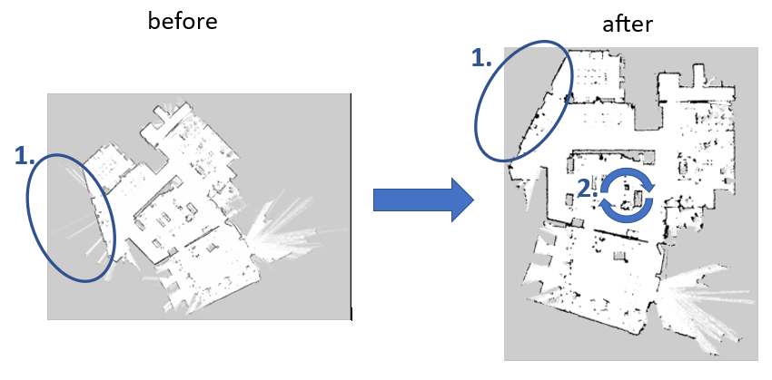

# **Preprocessing Overview**
The model_preprocessing class provided in this project is designed to process images in a specific manner to prepare them for further analysis.
*before and after image mark the diffrences note the goal number right next to it
## **Preprocessing Goals**
The primary goals of the preprocessing pipeline can be divided into two major tasks:


### **Goal 1: Removing Incorrectly Measured Values Behind Windows**
A common issue with the data obtained from LIDAR sensors is the incorrect measurement of obstacles behind transparent objects, like windows. The LIDAR laser passes through the window, detecting a point behind it as an obstacle. This creates what appears to be a free space pathway leading up to the obstacle in the resulting map.

The first goal of preprocessing is to remove these "thin beams" from the map, ensuring a more accurate representation of actual free spaces and obstacles in the environment.

### **Goal 2: Rotating the Map to Align Walls Parallel to Coordinate Axes**
The second goal of preprocessing is to rotate the image such that the walls in the map align parallel to the coordinate system's axes. This is based on the premise that walls in a building often share similar orientations and that having them aligned with the axes simplifies the algorithm's task when constructing the semantic hierarchical graph.

The challenge here lies in determining the angle of rotation. We must first detect the walls, determine their orientations, and then identify the most common orientation (which is done through clustering). This prevalent orientation is then used to rotate the image so that these walls align parallel with the X-axis.


## **Prepprocessing Steps**

1. **Thresholding:** Two types of thresholding are performed. The first identifies barriers (black pixels) in the image, while the second isolates open spaces. These binary images make it easier to identify significant elements in the subsequent steps.

2. **Dilation of Barriers:** Barriers in the image are dilated to create continuous lines. This helps us identify the walls more clearly and accurately.

3. **Removal of Incorrectly Measured Values:** Any incorrectly measured values in the image are removed. These could be due to noise, inaccuracies in data collection, or other factors.

4. **Orientation of Walls:** The orientation and lengths of walls in the image are calculated. This information is used to identify clusters of walls, with the orientation of the largest cluster being used to rotate the image. This rotation aligns the main orientation of the layout with the X-axis.

5. **Rotation of Image:** The final step in the preprocessing is to rotate the image according to the orientation of the largest cluster of walls. This step ensures that the primary structure of the layout is oriented horizontally.

## **Wall Detection**

1. **Thresholding:** First, we apply a binary threshold to the grayscale image. The aim is to isolate the dark pixels (representing barriers or walls) from the rest. The pixels that are below a certain threshold are turned white, while the others are turned black. This gives us an image where the walls (barriers) are represented as white pixels.

2. **Dilation:** In some cases, the walls might not be perfectly continuous, causing breaks or gaps. To rectify this, we use dilation, which effectively 'thickens' the white lines. This ensures that the walls appear as continuous lines, facilitating more accurate analysis.

3. **Line Detection:** Once we have a binary image with dilated walls, we use a line detection algorithm called the [Hough Transform](https://docs.opencv.org/3.4/d9/db0/tutorial_hough_lines.html), an algorithm proficient in identifying lines within an image, regardless of fragmentation or imperfections. Applied to a binary image, the method transforms each point in image space into a line in Hough space, defined by distance and angle to the origin. Intersections in Hough space correspond to lines in the image, enabling effective detection of dilated walls as continuous lines. Crucially, this transformation also yields the orientation and distance of these lines from the origin, providing essential data for subsequent operations, such as clustering of wall orientations.

4. **Orientation and Length Calculation:** From the lines detected by the Hough Transform, we can easily calculate the orientation and length of each line. This information is crucial for the next step, which is clustering.

## Clustering
Clustering is performed on the wall orientations obtained from the previous steps. The objective is to find groups (clusters) of lines that have similar orientations. This is based on the idea that walls in a building often share similar orientations. Moreover, the importance of each orientation in the clustering process is weighted by the corresponding wall's length. This ensures that longer walls, which likely represent significant architectural features, have a greater impact on the clustering result.

The specific algorithm used for clustering in this project is [DBSCAN](https://scikit-learn.org/stable/modules/generated/sklearn.cluster.DBSCAN.html) (Density-Based Spatial Clustering of Applications with Noise). This algorithm groups together points that are packed closely together (points with many nearby neighbors), marking points that lie alone in low-density regions as outliers.

In this case, the points being clustered are the wall orientations. The DBSCAN algorithm is particularly suitable for this task because it doesn't require us to specify the number of clusters in advance.

The output of the clustering step is the orientation of the largest cluster of walls. This orientation is then used to rotate the image so that the primary layout structure aligns with the X-axis.

## Usage

Here's a quick example of how you might use this class:

```python
    from preprocessing import model_preprocessing
    import cv2

    # Read the input image
    img = cv2.imread('path_to_your_image')

    # Create a model_preprocessing object
    preprocessor = model_preprocessing(img)

    # Access the final preprocessed image
    preprocessed_image = preprocessor.rotated_image
```

## Conclusion

The model_preprocessing class provides a comprehensive way to preprocess images for subsequent analysis. By identifying barriers and open spaces, correcting inaccuracies, identifying wall orientations, and aligning the image correctly, we can prepare complex images for more effective processing in subsequent steps.